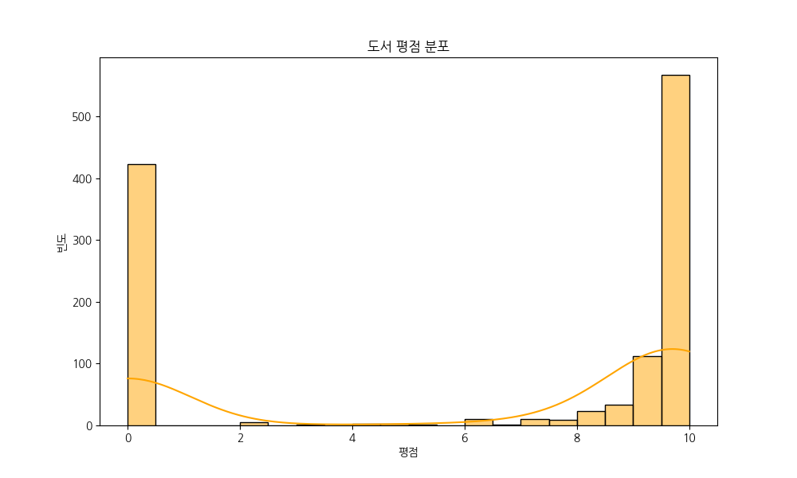
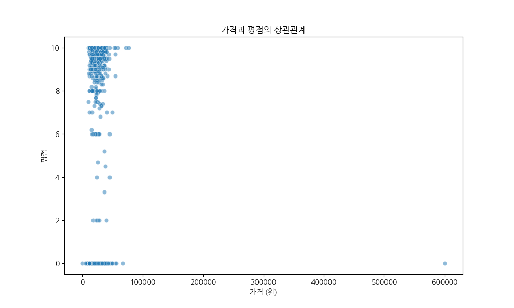

# Yes24 도서 데이터 분석 보고서

**생성 일자:** 2026-01-12 19:19
**데이터 소스:** `yes24/data/raw/yes24_books.csv`

## 1. 데이터 요약
- **총 도서 수:** 1,200권
- **평균 가격:** 22,446원
- **중앙 가격:** 20,700원
- **최고 가격:** 600,000원
- **최저 가격:** 0원
- **평균 평점:** 6.13점
- **평균 리뷰 수:** 10.2개

## 2. 주요 통계
### 상위 5개 출판사 (도서 수 기준)
- 커뮤니케이션북스: 205권
- 한빛미디어: 114권
- 길벗: 61권
- 제이펍: 59권
- 에이콘출판사: 51권

### 가장 비싼 도서 Top 3
- **인공지능총서 50종 세트 12**: 600,000원
- **컴퓨터 비전 5/e**: 76,500원
- **확률론적 머신러닝 : 기본편**: 72,000원

### 리뷰가 가장 많은 도서 Top 3
- **AI 리터러시 : 인공지능 필수 지식부터 완벽 활용까지**: 182개
- **정말 쉽네? 챗GPT 입문**: 150개
- **혼자 공부하는 머신러닝+딥러닝**: 141개

## 3. 시각화
### 가격 분포

### 평점 분포

### 상위 출판사

### 가격과 평점의 상관관계

