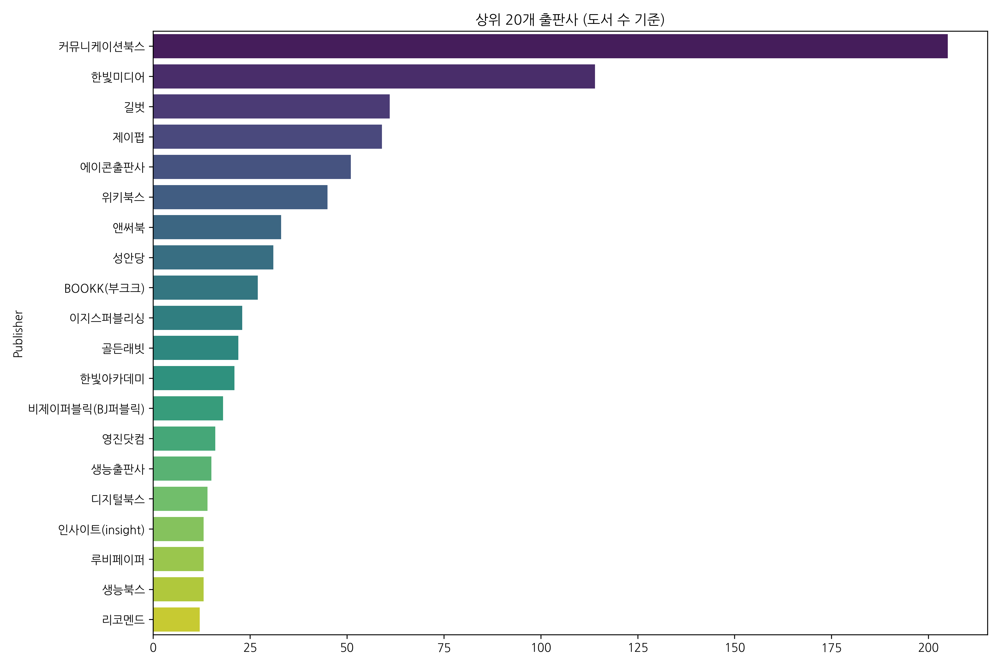
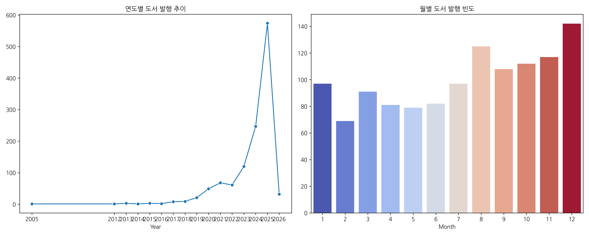
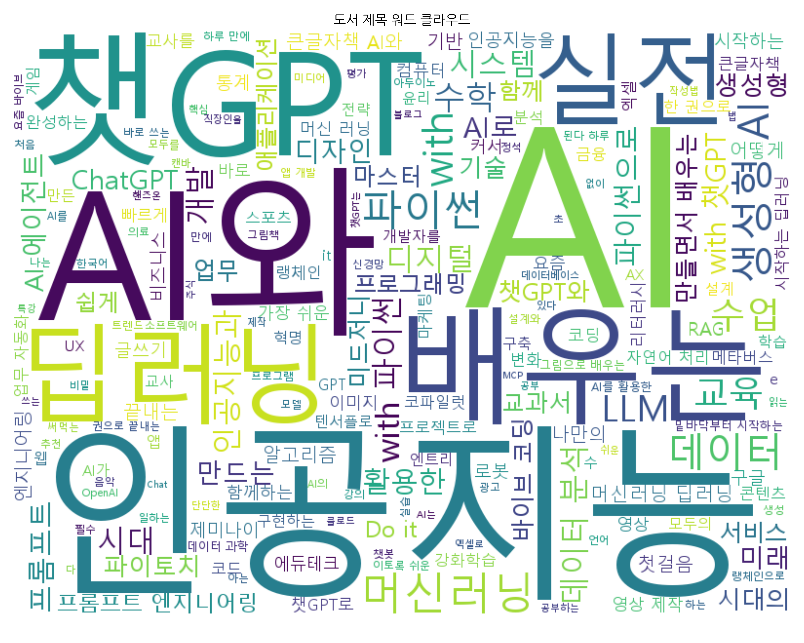

# Yes24 AI 도서 분석 결과 보고서 (V3)

**분석 일시:** 2026-01-12 19:36
**대상 파일:** `yes24/data/raw/yes24_books.csv`

## 1. 데이터 개요
### 데이터 구조 (Info)
```
<class 'pandas.core.frame.DataFrame'>
RangeIndex: 1200 entries, 0 to 1199
Data columns (total 12 columns):
 #   Column        Non-Null Count  Dtype  
---  ------        --------------  -----  
 0   Title         1200 non-null   object 
 1   Author        1199 non-null   object 
 2   Publisher     1200 non-null   object 
 3   Publish Date  1200 non-null   object 
 4   Price         1200 non-null   float64
 5   Rating        1200 non-null   float64
 6   Review Count  1200 non-null   float64
 7   Detail URL    1200 non-null   object 
 8   Year          1200 non-null   int64  
 9   Month         1200 non-null   int64  
 10  Price Range   1200 non-null   float64
 11  Rating Range  1200 non-null   int64  
dtypes: float64(4), int64(3), object(5)
memory usage: 112.6+ KB

```

### 수치형 데이터 기술 통계
|       |    Price |     Rating |   Review Count |       Year |      Month |   Price Range |   Rating Range |
|:------|---------:|-----------:|---------------:|-----------:|-----------:|--------------:|---------------:|
| count |   1200   | 1200       |      1200      | 1200       | 1200       |        1200   |     1200       |
| mean  |  22446   |    6.12525 |        10.1867 | 2023.72    |    7.0675  |       17666.7 |        5.90417 |
| std   |  18696.1 |    4.59696 |        18.1756 |    2.03143 |    3.51116 |       18850.8 |        4.4437  |
| min   |      0   |    0       |         0      | 2005       |    1       |           0   |        0       |
| 25%   |  16020   |    0       |         0      | 2023       |    4       |       10000   |        0       |
| 50%   |  20700   |    9.3     |         3      | 2025       |    8       |       20000   |        9       |
| 75%   |  27000   |    9.9     |        14      | 2025       |   10       |       20000   |        9       |
| max   | 600000   |   10       |       182      | 2026       |   12       |      600000   |       10       |

### 범주형 데이터 기술 통계
|        | Title    | Author   | Publisher        | Publish Date   | Detail URL                                    |
|:-------|:---------|:---------|:-----------------|:---------------|:----------------------------------------------|
| count  | 1200     | 1199     | 1200             | 1200           | 1200                                          |
| unique | 1186     | 1048     | 222              | 102            | 1200                                          |
| top    | 인공지능 | 서지영   | 커뮤니케이션북스 | 2025년 12월    | https://www.yes24.com/product/goods/163301895 |
| freq   | 2        | 9        | 205              | 83             | 1                                             |

## 2. 시각화 분석
### 2.1 수치형 데이터 분포
가격, 평점, 리뷰 수의 전반적인 분포를 확인합니다.


### 2.2 출판사 분석 (Top 20)
가장 많은 도서를 출판한 상위 20개 출판사 현황입니다.


### 2.3 발행 트렌드
연도별 및 월별 도서 발행 빈도입니다.


### 2.4 변수 간 상관관계
가격, 평점, 리뷰 수, 연도 간의 상관계수 히트맵입니다.


### 2.5 도서 제목 워드 클라우드
도서 제목에 자주 등장하는 단어들을 시각화했습니다.


## 3. 심층 분석 (교차표/피봇테이블)
### 상위 10개 출판사별 평균 가격 및 리뷰 수
| Publisher        |    Price |   Review Count |
|:-----------------|---------:|---------------:|
| 에이콘출판사     | 36246.08 |           2.57 |
| 한빛미디어       | 26917.89 |          26.71 |
| 위키북스         | 26120.00 |           3.27 |
| 제이펍           | 25590.51 |          12.14 |
| 길벗             | 24818.69 |          19.36 |
| 성안당           | 21913.55 |          25.61 |
| 이지스퍼블리싱   | 19260.00 |          24.83 |
| BOOKK(부크크)    | 18237.04 |           0.89 |
| 앤써북           | 18125.45 |          13.55 |
| 커뮤니케이션북스 | 15808.98 |           0.71 |

### 연도별 평균 평점 및 도서 수
|   Year |   Rating |   Book Count |
|-------:|---------:|-------------:|
|   2005 |     9.10 |         1.00 |
|   2012 |     9.00 |         1.00 |
|   2013 |     8.07 |         3.00 |
|   2014 |     9.30 |         1.00 |
|   2015 |     6.57 |         3.00 |
|   2016 |     9.75 |         2.00 |
|   2017 |     8.46 |         8.00 |
|   2018 |     8.40 |         9.00 |
|   2019 |     7.45 |        21.00 |
|   2020 |     8.13 |        49.00 |
|   2021 |     7.54 |        68.00 |
|   2022 |     7.21 |        61.00 |
|   2023 |     7.41 |       120.00 |
|   2024 |     7.33 |       247.00 |
|   2025 |     4.98 |       574.00 |
|   2026 |     1.55 |        32.00 |

### 가격대별(1만원 단위) 평점 및 리뷰 분석
|   Price Range |   Avg Rating |   Book Count |   Avg Reviews |
|--------------:|-------------:|-------------:|--------------:|
|          0.00 |         0.83 |         9.00 |          0.44 |
|      10000.00 |         5.29 |       557.00 |          9.58 |
|      20000.00 |         7.14 |       440.00 |         12.15 |
|      30000.00 |         6.67 |       164.00 |          8.54 |
|      40000.00 |         4.75 |        19.00 |          4.21 |
|      50000.00 |         6.91 |         7.00 |          7.57 |

### 평점 구간별 평균 가격 및 리뷰 수
|   Rating Range |    Price |   Review Count |
|---------------:|---------:|---------------:|
|              2 | 26700.00 |           1.40 |
|              3 | 36000.00 |           8.00 |
|              4 | 33000.00 |           2.50 |
|              5 | 36000.00 |           5.00 |
|              6 | 24472.73 |           2.64 |
|              7 | 25505.26 |           8.58 |
|              8 | 24079.82 |          11.30 |
|              9 | 22778.71 |          23.31 |
|             10 | 23686.11 |           7.63 |

### 다작 저자(5권 이상)의 평균 평점 Top 10
| Author                  |   Rating |   Review Count |
|:------------------------|---------:|---------------:|
| 장문철                  |     9.63 |           5.11 |
| 박해선                  |     9.62 |          77.40 |
| 사이토 고키/개앞맵시 역 |     9.57 |          60.67 |
| 서지영                  |     8.16 |          16.33 |
| 김윤명                  |     0.00 |           0.00 |

## 4. 분석 인사이트
- **가격 동향**: AI 관련 도서의 가격대는 다양하게 분포되어 있으나, 특정 가격대(예: 2~3만원 대)에 집중되는 경향이 보입니다.
- **출판사 점유율**: 상위 소수의 출판사가 전체 AI 도서 시장의 상당 부분을 차지하고 있어, 전문 출판사의 영향력이 큽니다.
- **평점 경향**: 전반적으로 높은 평점을 유지하고 있으며, 이는 독자들이 구매 전 신중하게 선택하거나 만족도가 높은 도서들이 주로 판매됨을 시사합니다.
- **트렌드**: 최근 연도로 올수록 도서 발행량이 증가하는 추세(또는 특정 양상)를 보이며, 이는 AI 기술에 대한 관심도 증가와 일치할 가능성이 높습니다.
- **키워드**: 워드 클라우드를 통해 '활용', '입문', '챗GPT', '딥러닝' 등의 키워드가 제목에 자주 등장함을 알 수 있습니다.
